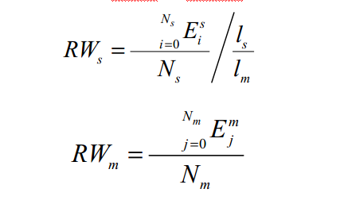
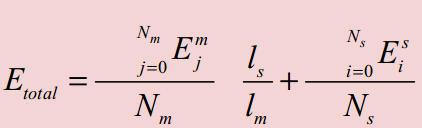

# WLAFTL算法
## 总体构架
#### 数据分配机制
一旦文件系统有新的写请求到来，首先经过磨损均衡控制机制判断SLC和MLC区域之间的磨损快慢，根据两个区域的磨损速率来调整阈值th的大小，由热数据识别机制将小于阈值th的写请求分配给SLC，负载大于阈值th的写请求分配到MLC区域。
#### 数据迁移机制
当SLC区域中空闲块不足的时候，垃圾回收机制被触发，选择最先写入的数据块作为垃圾回收的目标块，然后分别根据延迟迁移或正常迁移策略将目标块中的数据页进行内部迁移或移动到MLC区域，再擦除该块进行回收，如果是更新的写请求，意味着此数据为热数据，直接分配到SLC区域。
#### 磨损均衡机制
WLAFTL的磨损机制包括区域内磨损均衡和区域间磨损均衡。区域内磨损均衡机制指的是SLC和MLC区域内各块内部的磨损均衡。区域间磨损均衡指的是SLC区域和MLC区域之间的磨损均衡。将SLC区域作为循环队列使用，可以保证SLC内部块的磨损均衡一致。MLC通过内部统计监视各个块的擦除次数，优先选择擦除次数最少的块来存储数据，通过这种方式实现MLC内部块间的磨损均衡。区域间磨损均衡主要靠两种方式：基于磨损均衡的热数据识别阈值调整和冷数据从SLC到MLC的冷数据迁移。

## 数据分配机制详解
### 算法原理
WLAFTL算法也是根据请求的大小进行热数据识别的，也是通过比较请求的大小和当前的阈值决定是否写入到SLC还是MLC。但阈值的th根据SLC和MLC的磨损速度进行调整的。阈值th的调整基于这样一个事实：阈值th过大，则过多的数据被写入到SLC，导致SLC磨损速度过快，但是阈值th过小，更多的数据被写入到MLC中，导致MLC的磨损速度变快。王发宽师兄的论文中这样调整阈值th：
令Ns和Nm分别作为SLC和MLC闪存块的总数量，Ls和Lm分别表示SLC和MLC闪存块的擦除周期（也就是最大擦除次数），Esi和Emj分别表示SLC闪存块和MLC闪存块中每个块当前的擦除次数。SLC和MLC区域的相对磨损速率RWs和RWm分别定义为：



混合SSD的等效总擦除次数定义为：



磨损均衡程度定义：
**V=max(RWs,RWm)/min(RWs,RWm)**
当[RWs]=[RWm]时,([*]表示取整),即V为1，可以认为此时SLC和MLC的磨损速度一致，此时处于磨损均衡的状态。令阈值Vth为磨损均衡效果的合理范围，Vth值可以根据实际需求自由配置。当V>Vth时调整阈值th，使得磨损均衡程度V接近于1；当V<=Vth时，此时磨损效果在合理范围，不调整阈值th。具体来说，当V大于Vth时，如果[RWs]>[RWm],说明此时SLC区域比MLC区域更快，因此需要减小阈值th，使得更多的写请求被分配到MLC区域，直到磨损速率回归到[RWs]=[RWm]状态；反之如果[RWs]<[RWm],则需要增大阈值th，将更多的写请求分配到SLC区域，直到磨损速度回到[RWs]=[RWm]。综上所诉，WLAFTL提出的基于磨损均衡算法机制如下伪代码所示阈值th的增减，其值根据不同的需求进行自行设定的。
```bash
算法1. WLAFTL算法的数据分配机制
1: request R with logical page number Rlpn, request size Rsize , request type Rtype 
2: LPN= Rlpn ,Size= Rsize ;
3: θ: threshold of request size, initially 4 KB; 
4: WHILE Size≠0 DO 
5:  IF Rtype is read THEN
6:    Search PPN mapped to LPN in the page mapping table;
7:      IF the PPN exist in SLC region THEN
8:         read from SLC region; 
9:      ELSE
10:        read from MLC region; 
11:     END
12:  ELSE /* Rtype is write */
13:     IF it is an update request THEN
14:       update R in SLC region;
15:     ELSE          
16:       IF RWs==RWm THEN	     /* SLC与 MLC 区域磨损速率相等 */
17:         θ←θ;              	     /* θ不变 */
18:       ELSE IF RWs>RWm THEN	/* SLC区域磨损速率大于MLC区域 */
19:         θ←max{0,θ - ∆θ};          /* 减小θ，减少SLC区域的写数据接收量 */
20:       ELSE                      /* MLC区域磨损速率大于SLC区域*/      
21:         θ←θ + ∆θ;                /*增大θ，增加SLC区域的写数据接收量*/   
22:       END 
23:       IF Size<=θ THEN         
24:         write R to SLC region;    
25：     ELSE
26:         write R to MLC region;
27:      END
28:    END      
29:  END
```
### 代码实现细节
具体的代码操作在disksim_iotrace.c中`static ioreq_event * iotrace_ascii_get_ioreq_event_1 (FILE *tracefile, ioreq_event *new)`函数中，其中的RW_flag被传值到dftl.c配合SLC的数据迁移使用。RW_flag=0表示SLC的磨损率小于等于MLC的速率，其他SLC的循环队列操作和CFTL很类似
```cpp
static ioreq_event * iotrace_ascii_get_ioreq_event_1 (FILE *tracefile, ioreq_event *new)
{
   char line[201];
   int th,sbcount,mbcount,threhold,diff,Es,Em,sblkno;
   _u32 RWs,RWm;
   int cnt,i,j,ppn;
   sect_t s_psn,s_psn1,s_lsn;
   blk_t pbn,pin;
   if (fgets(line, 200, tracefile) == NULL) {
      addtoextraq((event *) new);
      return(NULL);
   }
   if (sscanf(line, "%lf %d %d %d %x\n", &new->time, &new->devno, &new->blkno, &new->bcount, &new->flags) != 5) {
      fprintf(stderr, "Wrong number of arguments for I/O trace event type\n");
      fprintf(stderr, "line: %s", line);
      ddbg_assert(0);
   }

   //flashsim,计算对应的相对磨损速率
   RWs=SLC_stat_erase_num/40960;
   //这里根据当前SLC和MLC的块个数修改对应除数
   RWm=MLC_stat_erase_num/32768;
  // RWs=SLC_stat_erase_num/1000;
  // RWm=MLC_stat_erase_num/100;
   diff=abs(RWs-RWm);
   //这里等效SLC是MLC的10倍,SLC是512MB的容量，则按2K页，128KB块，则SLC块为4096块
   //MLC的页为4K页，256KB块，1GB的MLC的块数为4096
   Es=SLC_stat_erase_num%40960;
   Em=MLC_stat_erase_num%4096;
   threhold=abs(Es-Em);
   //当更新写清到来，判断写到SLC还是MLC
  if(new->flags==0){ 
     printf("SLC磨损速度：%d\n",SLC_stat_erase_num);
     printf("MLC磨损速度：%d\n",MLC_stat_erase_num);
     //下面的阈值选择调整太手工了。。。。。很魔幻。。。
     if(RWs==RWm){
         RW_flag=0;
//         th=8;
         th=4;
     }else if(RWs<RWm){
         RW_flag=0;
         if((RWm-RWs)==1){
        // th=12;
            th=5;
         }else if((RWm-RWs)==2){
             //  th=18;
            th=6;
         }else{
             //th=22;
            th=7;
         }
     }else{
         RW_flag=1;
         if((RWs-RWm)==1){
             if(th<=8){//th<=8
          //  th=2;
                th=1;
             }else {
          //  th=4;
                th=2;
             }
         }else{
          // yuzhi++;
                th=0;
//                printf("第13种情况\n");
         }
     }
     sblkno=new->blkno;
     sbcount=((new->blkno+ new->bcount-1)/4 - (new->blkno)/4 + 1) * 4;
     sblkno /= 4;
     sblkno *= 4;
     cnt= (sblkno+ sbcount-1)/4 - (sblkno)/4 + 1;
     //根据阈值th比较判断写入SLC还是MLC
     if(cnt<=th){
         if(new->blkno>=1048544){
             new->blkno=new->blkno-1048544;
         }
         new->flash_op_flag=0;
         new->bcount=((new->blkno+ new->bcount-1)/4 - (new->blkno)/4 + 1) * 4;
         new->blkno /= 4;
         new->blkno *= 4; 
     }else{ 
         new->flash_op_flag=1;
         new->bcount = ((new->blkno+ new->bcount-1)/8 - (new->blkno)/8 + 1) * 8;
         new->blkno /= 8;
         new->blkno *= 8; 
     }
  }else{ 
      new->flash_op_flag=1;
      new->bcount = ((new->blkno+ new->bcount-1)/8 - (new->blkno)/8 + 1) * 8;
      new->blkno /= 8;
      new->blkno *= 8; 
  }
  
//  和req_even同步相关的代码操作
   if (new->flags & ASYNCHRONOUS) {
      new->flags |= (new->flags & READ) ? TIME_LIMITED : 0;
   } else if (new->flags & SYNCHRONOUS) {
      new->flags |= TIME_CRITICAL;
   }

   new->buf = 0;
   new->opid = 0;
   new->busno = 0;
   new->cause = 0;
   return(new);
}

```


## 数据迁移机制
### SLC区域数据迁移机制
WLAFTL为了更好的实现SLC区域各块间的磨损均衡，参考了CFTL的做法，将SLC区域当做循环队列使用（但不像CombFTL分为warm和hot区域那么复杂），新来的数据写入到head指针指向的块，当SLC空余块小于一定阈值。启动垃圾回收机制，回收tail指针指向的块，然后将tail指针前移。**该机制就是一个FIFO**。这种数据迁移机制存在SLC区域较小时，则热数据过早被剔除MLC区域。为此，WLAFTL增加了CombFTL一样的N次机会策略。具体方法是：对SLC的地址映射表的每个映射项加入一个Cycle_Time变量来记录数据停留在SLC区域的循环周期数，当垃圾回收目标块中所对应的页为有效数据页且循环一周，则Cycle_time值加1.最后根据Cycle_time的大小和SLC和MLC的磨损均衡情况决定采用何种迁移机制。算法的伪代码如下：
```bash
算法2. SLC区域数据迁移 
1: Require: 
2: Cycle_Time: the counter of cycle times for each valid page in the SLC region
3:   Source block: the tail block of SLC region
4:   Target block: the head block of SLC region
5: WHILE the number of free block in the SLC region < 4 DO 
  /*启动垃圾回收机制*/
6:   FOR each valid page in the Source block DO
7:      IF RWs<=RWm THEN    
8：    /*启动延迟迁移策略*/        
9:         IF Cycle_Time = = Max_Cycle_Time THEN  
10:            move the valid pages to MLC region;
11:            Cycle_Time ← 0;
12:        ELSE
13:           copy the valid pages to the Target block of SLC region;
14:           Cycle_Time ← Cycle_Time +1;
15:        END 
16:     ELSE  
/* 当 RWs>RWm , 启动正常迁移策略 */
17:        move the valid pages to MLC region;
18:        Cycle_Time ← 0;
19:     END 
20:   END 
21: END 
```
#### 延迟迁移策略
在SLC磨损速率低于或者等于MLC速率时，只有当垃圾目标块中的有效页的Cycle_time值等于大于最大循环次数Max_Cycle_time时，该页才会作为更新不频繁的冷数据页迁移到MLC，当有效数据页的Cycle_time小于Max_Cycle_time时，该有效数据页被复制到LSC区域head指针所指的块中，并将对应的Cycle_time值加1，开始新的一轮循环。通过这种方式，使得SLC中的数据能够迁移到SLC区域停留Max_Cycle_time个循环周期，从而增加其在SLC被服务的机会。
#### 正常迁移策略
在SLC磨损速率高于MLC磨损率，垃圾回收启动时，将垃圾回收目标块中的有效数据页的数据直接迁移到MLC区域，减少SLC的写入次数，从而降低其磨损速度。
### 代码实现细节
SLC到MLC的数据迁移代码位于dftl.c源文件中函数`void SLC_data_move(int blk)`：
```cpp
void SLC_data_move(int blk){
     int i,valid_flag,valid_sect_num;
     int blkno,bcount;
     double delay3;
     _u32 victim_blkno;
     _u32 copy_lsn[S_SECT_NUM_PER_PAGE];

     for(i=0;i<S_PAGE_NUM_PER_BLK;i++){
         valid_flag=SLC_nand_oob_read(S_SECTOR(blk,i*S_SECT_NUM_PER_PAGE));
         if(valid_flag==1){
             valid_sect_num=SLC_nand_page_read(S_SECTOR(blk,i*S_SECT_NUM_PER_PAGE),copy_lsn,1);
             ASSERT(valid_sect_num==4);
//             如果RW_flag表示SLC的磨损速率小于等于MLC，采用延迟回写策略
             if(RW_flag==0){
//                 N次机制,通过SLC_opagemap[lpn].count位实现，N这里为2
                 if(SLC_opagemap[S_BLK_PAGE_NO_SECT(copy_lsn[0])].count<2){
                     SLC_opagemap[S_BLK_PAGE_NO_SECT(copy_lsn[0])].ppn=S_BLK_PAGE_NO_SECT(S_SECTOR(free_SLC_blk_no[1],free_SLC_page_no[1]));
                     SLC_nand_page_write(S_SECTOR(free_SLC_blk_no[1],free_SLC_page_no[1])&(~S_OFF_MASK_SECT),copy_lsn,1,1);
                     free_SLC_page_no[1]+=S_SECT_NUM_PER_PAGE;
                     SLC_opagemap[S_BLK_PAGE_NO_SECT(copy_lsn[0])].count+=1;
                     SLC_to_SLC_num++;
                 }else{
//                     反之直接回写到MLC
                     SLC_opagemap[S_BLK_PAGE_NO_SECT(copy_lsn[0])].ppn=-1;
                     SLC_opagemap[S_BLK_PAGE_NO_SECT(copy_lsn[0])].count=0;
                     blkno=(S_BLK_PAGE_NO_SECT(copy_lsn[0])*4)/8;
                     blkno*=8;
                     bcount=8;
                     SLC_to_MLC_num++;
                     delay3=callFsim(blkno,bcount,0,1);
                     delay2=delay2+delay3;
                 }
             }else{
//                 正常迁移策略，直接迁移到MLC中去
                 SLC_opagemap[S_BLK_PAGE_NO_SECT(copy_lsn[0])].ppn=-1;
                 SLC_opagemap[S_BLK_PAGE_NO_SECT(copy_lsn[0])].count=0;
                 blkno=(S_BLK_PAGE_NO_SECT(copy_lsn[0])*4)/8;
                 blkno*=8;
                 bcount=8;
                 SLC_to_MLC_num++;
                 delay3=callFsim(blkno,bcount,0,1);
                 delay2=delay2+delay3;
             }
         }
     }
     victim_blkno=blk;
     SLC_nand_erase(victim_blkno);
}
```